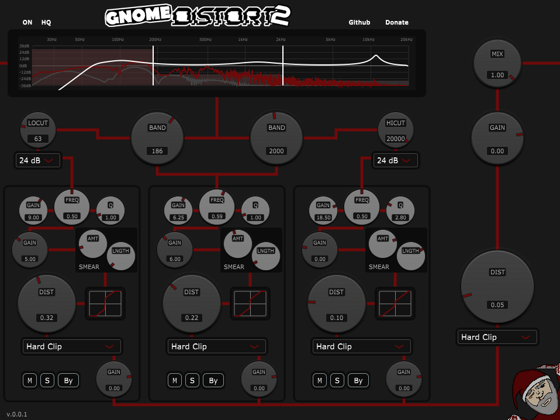
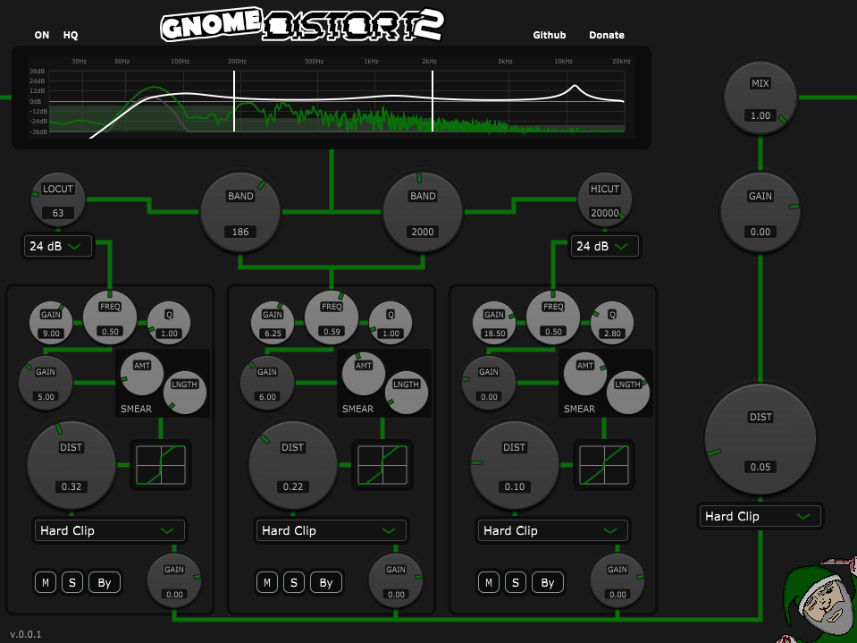
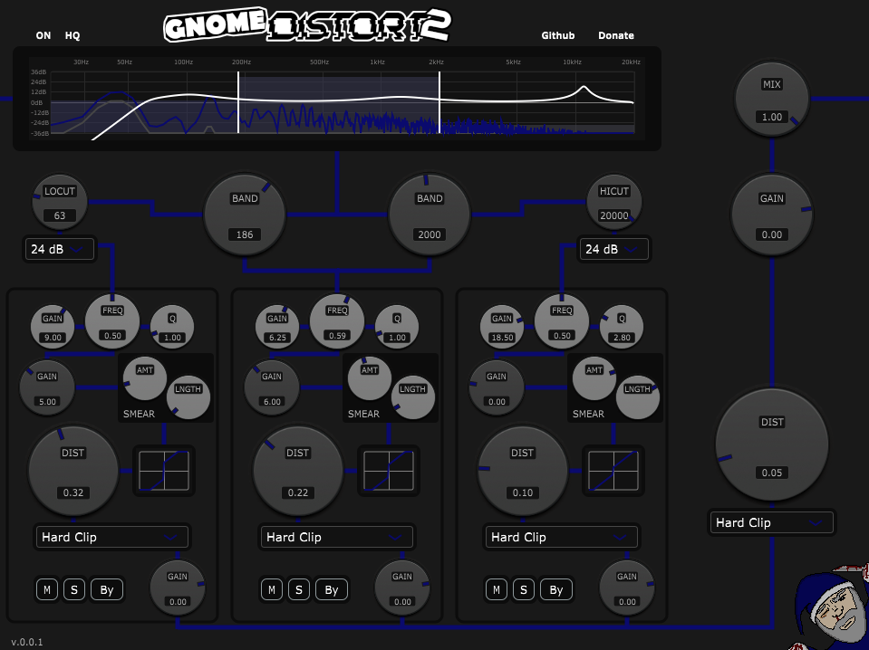

# GnomeDistort 2

<div align="center">
    <p style="font-size: 1.5em">HARDER | BETTER | 𝖜𝖊𝖎𝖗𝖉𝖊𝖗 | STRONGER</p>
    
</div>

## Contents
- [Features](#features)
- [Installation](#installation)
  - [Pre-built for Windows](#pre-built-for-windows)
  - [Pre-built for MacOS and Linux](#pre-built-for-macos-and-linux)
- [Usage tips](#usage-tips)
- [Build](#build)
- [Themes](#themes)
- [Acknowledgements](#acknowledgements)

<div align="center">
	<a href='https://ko-fi.com/crowbait' target='\_blank'></a>
</div>

---

## Features
Brutal multi-band distortion plugin with unique functions

- Global low- and high-cut filters with variable slopes
- 3 frequency bands (possible ranges: 20-999Hz, 20Hz-20kHz, 1-20kHz)
- Per band:
  - Peak filter with high gain range
  - very high range input gain
  - Unique SMEAR (just try it)
  - "Somewhat tame-ish" to "brutally destructive" waveshaper options
  - Output gain meant for reduction
- Global post-stage waveshaper (same options as in bands)
- Themes!

---

## Installation
#### Pre-built for Windows
Just grab your `.vst3` file from the [releases page](https://github.com/crowbait/GnomeDistort-2/releases) and put it into whatever folder you keep your VSTs in. This plugin is compiled against x64 Windows and is tested on Win11.

---
#### Pre-built for MacOS and Linux
Grab the `zip` for your platform from the [releases page](https://github.com/crowbait/GnomeDistort-2/releases) and unzip it into whatever folder you keep your VSTs in. The `zip` includes a folder called `GnomeDistort 2.vst3`; just treat this folder as a VST3 file.

**Warning: MacOS builds are *entirely* untested and *should* but *may not* work.** I simply lack the Apple hardware to test things. Should you encounter problems with the pre-built MacOS files, consider following the [Build](#build)-chapter. **The same applies if you need an AU.**

---

## Usage tips
- The output gain sliders are not decorative, use them! This plugin features extreme gain values and clipping and output gain adjustments ARE necessary.
- Because of the extreme gains and clipping, it may be necessary to noise-gate the input signal (depending on what precisely you're doing). Just use your favorite noise gate in front of GnomeDistort.
- Play around with the low cut and peak filters! It's fun!

---

## Build
Clone the repo and initialize the JUCE library:
```
git clone https://github.com/crowbait/GnomeDistort-2.git
cd GnomeDistort-2
git submodule update --init --recursive
```
The JUCE library can be updated to it's latest version using `git submodule update --recursive --remote` but this should not be done if not necessary.

#### Option 1 - Projucer (Recommended)
This method is clunkier than Option 2 but more reliable. If you'd like, you can also try Option 2 (CMake) first.
1. Navigate to `JUCE/extras/Projucer/Builds/` and pick one according to your platform
2. Open and/or compile the contained project
3. Start the freshly compiled Projucer executable and use it to open the `GnomeDistort 2.jucer` file at the root of the repo
4. *Optional:* register an account with [JUCE](https://juce.com/) and enable GPL mode in projucer
5. *Optional:* to change the output formats (eg. because you want an AU), click the settings icon in the top left, scroll to `Plugin Formats` and select those you need
6. At the top, select whatever is appropriate and hit the big button. Compile, find your putput in `Builds/` (where exactly depends on your platform)

---
#### Option 2 - CMake
This method is simpler (if you have CMake set up) and more straight-forward than using Projucer, but may be less reliable. You need CMake and a compiler installed.
1. *On Linux* install dependencies (in my tests, this was needed on Ubuntu, but not on Arch Linux. You can try compiling without installing deps first, it can't do anything worse than failing).
```
sudo apt update
sudo apt install -y cmake build-essential pkg-config libasound2-dev libjack-jackd2-dev ladspa-sdk libcurl4-openssl-dev libfreetype6-dev libx11-dev libxcomposite-dev libxcursor-dev libxcursor-dev libxext-dev libxinerama-dev libxrandr-dev libxrender-dev libwebkit2gtk-4.0-dev libglu1-mesa-dev mesa-common-dev
```
2. create directory:
```
cmake -E make_directory ./Builds/CMake`
```
3. *On UNIX (MacOS or Linux)* configure CMake and build: 
```
cd Builds/CMake
cmake -DCMAKE_BUILD_TYPE=Release ../../
cmake --build ./
```
3. *On Windows* configure CMake and build:
```
cd Builds/CMake
cmake ../../
cmake --build ./ --config Release
```
Your output is buried in `Builds/CMake/GnomeDistort2_artefacts/Release`.

---

## Themes
GnomeDistort 2 comes with a variety of themes (maybe more in future updates) which are accessible via click on the gnome:
<div align="center">
    
    
    
    
    
    
    
    
    
</div>

---

<div align="center">
	<a href='https://ko-fi.com/crowbait' target='\_blank'></a>
</div>

## Acknowledgements
- Mo for [gnoming](Assets/gnome.png)
- Retron for rubberducking, unqualified problem solving and ideas
